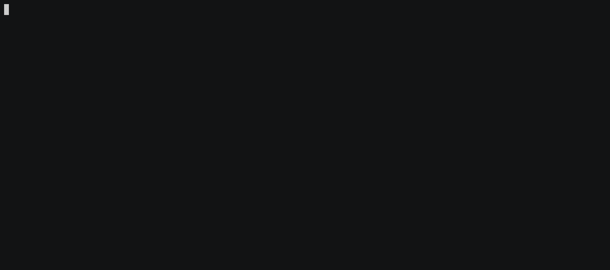

# emommit

[](https://codecov.io/gh/chyroc/emommit)
[](https://goreportcard.com/report/github.com/chyroc/emommit)
[](https://github.com/chyroc/emommit/actions)
[](https://opensource.org/licenses/Apache-2.0)
[](https://pkg.go.dev/github.com/chyroc/emommit)
[](https://badge.fury.io/go/github.com%2Fchyroc%2Femommit)



## Install

### By Brew

```shell
brew install chyroc/tap/emommit
```

### By Go

```shell
go install github.com/chyroc/emommit@latest
```

## Usage

### Simple to use

Just run `emommit`:

```shell
emommit
```

This is equivalent to running `git commit -m "<generate message>"`.

`emommit` will start an interactive program to let you choose emoji(such as 🐛) and git commit type(such as fix).

### Customized git commit command

If you want to customize the git commit command, you can add `--` after the `emommit` command, and then add any commands supported by git commit.

Such as auto stage all modified files and commit with a message:

```shell
emommit -- -a
```